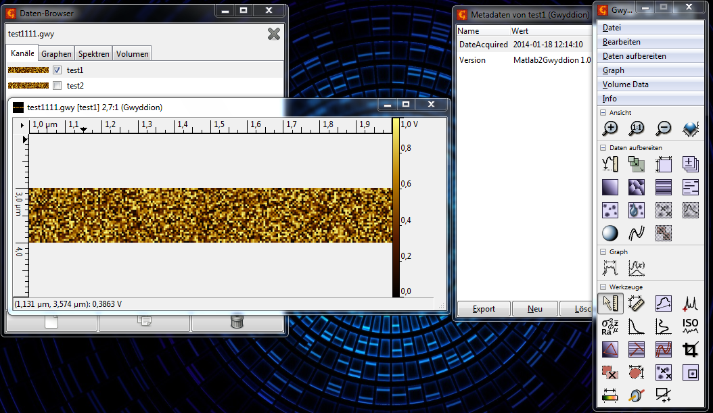

Matlab2Gwyddion
===============

Save Matlab data from SPM/AFM scans for use with Gwyddion

#What is Gwyddion?
"Gwyddion is a modular program for SPM (scanning probe microscopy) data visualization and analysis. Primarily it is intended for analysis of height fields obtained by scanning probe microscopy techniques (AFM, MFM, STM, SNOM/NSOM) " ([http://gwyddion.net/](http://gwyddion.net/))

#Functions
**saveasgsf** saves a NxM Matrix in the Gwyddion Simple Field file format (**.gsf**) (one Channel only)

**saveasgwy** saves a NxM or NxMxL Matrix in the Gwyddion native file format (**.gwy**)

General function call:
```matlab
  saveasgsf(filename,data,numstepsx,numstepsy,startx,endx,starty,endy,label,unit,time,varargin)
  saveasgwy(filename,data,numstepsx,numstepsy,startx,endx,starty,endy,label,unit,time,varargin)
```

Example:
```matlab
	saveasgsf('test.gsf',rand(30,200),200,30,1,2,3,4,'Chan1','V',now);
	saveasgsf('test.gsf',rand(30,200),200,30);
	saveasgwy('test.gwy',rand(30,200,2),200,30,1,2,3,4,{'test1','test2'},{'V','m'},now);
```

This code is also available via Mathworks FileExchange: [http://www.mathworks.com/matlabcentral/fileexchange/45092](http://www.mathworks.com/matlabcentral/fileexchange/45092) 

